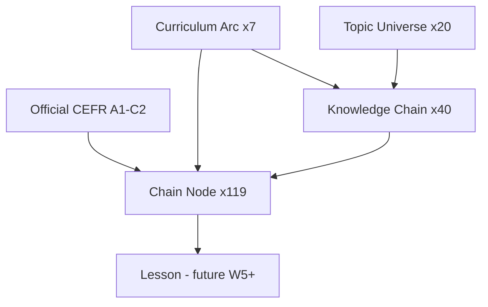

# Writing W1 — Topic Universe Report

**Phase:** W1 (Educational Knowledge Architecture)
**Status:** Complete — **18/18 verification checks passed**
**Catalog version:** `1.0.0`

---

## 1. Objective

Built the complete **Writing Topic Universe** — the curated educational world that all future Writing lessons must originate from. No isolated prompts. No lesson generation in this phase.

---

## 2. Canonical Hierarchy (implemented)

```
Official CEFR
    ↓
Curriculum Arc
    ↓
Topic (20 topics)
    ↓
Knowledge Chain (40 chains)
    ↓
Lesson (119 nodes — future phases bind one node → one lesson)
```

Every knowledge chain node defines: CEFR, arc, topic, chain, context complexity (1–5), vocabulary categories, grammar focus, suggested goals, graph links, and learning objectives.

---

## 3. Topic Universe (20 topics)

| Topic ID | Label | Chains |
|----------|-------|--------|
| `travel` | Travel | `travel_airport_journey`, `travel_hotel_stay` |
| `education` | Education | `education_school_life`, `education_university_path` |
| `business` | Business | `business_email_flow`, `business_proposal` |
| `technology` | Technology | `technology_product_review`, `technology_how_to` |
| `health` | Health | `health_symptoms`, `health_appointment` |
| `family` | Family | `family_introductions`, `family_celebration` |
| `work` | Work | `work_job_search`, `work_workplace` |
| `shopping` | Shopping | `shopping_online`, `shopping_complaint` |
| `environment` | Environment | `environment_local`, `environment_global` |
| `science` | Science | `science_experiment`, `science_explainer` |
| `entertainment` | Entertainment | `entertainment_review`, `entertainment_event` |
| `culture` | Culture | `culture_tradition`, `culture_visit` |
| `history` | History | `history_biography`, `history_argument` |
| `food` | Food | `food_recipe`, `food_restaurant_review` |
| `sports` | Sports | `sports_event`, `sports_fitness` |
| `daily_life` | Daily Life | `daily_routine`, `daily_neighborhood` |
| `communication` | Communication | `communication_messages`, `communication_online` |
| `services` | Services | `services_bank`, `services_government` |
| `housing` | Housing | `housing_search`, `housing_maintenance` |
| `society` | Society | `society_community`, `society_issue` |

**Totals:** 20 topics · 40 chains · 119 nodes

---

## 4. Curriculum Arcs (7)

Defined in `language_writing_curriculum/arc_catalog.py`:

| Arc | Min CEFR | Word range | Purpose |
|-----|----------|------------|---------|
| Sentence Building | A1 | 15–60 | Clear sentences |
| Paragraph Writing | A1 | 40–120 | Coherent paragraphs |
| Narrative Writing | A2 | 60–180 | Stories & recounts |
| Opinion Writing | A2 | 80–200 | Viewpoints with reasons |
| Formal Writing | B1 | 80–220 | Polite real-world messages |
| Professional Writing | B1 | 100–280 | Workplace writing |
| Academic Writing | B2 | 120–350 | Essays & evidence |

Each chain declares a `primary_arc`; individual nodes may progress across arcs within the chain (e.g. Travel: sentence → formal complaint → opinion review).

---

## 5. Flagship Knowledge Chain — Travel

```
Airport Arrival → Check-in → Security → Delayed Flight → Complaint Email → Refund Request → Travel Review
```

- **7 nodes**, complexity 1 → 5
- Carries narrative continuity (`carry_forward_template` on later nodes)
- Cross-chain hint: `travel_review.future_node_ids` → `travel_hotel_stay`

---

## 6. Node Metadata Specification

Document: `language_writing_knowledge_chain/NODE_METADATA_SPEC.md`

Required per node: `official_cefr`, `arc_stage`, `topic_id`, `chain_id`, `node_id`, `context_complexity`, `vocabulary_categories`, `grammar_focus_primary/secondary`, `suggested_goals`, `previous/next/review/future_node_ids`, `learning_objectives`, `narrative_why`, `task_type`, `genre`, `position`.

---

## 7. Progression Rules

Implemented in `language_writing_knowledge_chain/progression_rules.py`:

1. **Entry** — First node in chain if CEFR allows
2. **Prerequisites** — All `previous_node_ids` must be completed
3. **CEFR floor** — Node CEFR ≤ official + 1 band (stretch)
4. **Linear recommend** — `recommend_next_node()` advances along `next_node_ids`
5. **No random access** — `can_access_node()` enforces graph

---

## 8. Relationship Diagram



---

## 9. Key Files

| File | Purpose |
|------|---------|
| `language_writing_topic_universe/catalog_v1.py` | Full universe data |
| `language_writing_topic_universe/registry.py` | Load & query API |
| `language_writing_curriculum/arc_catalog.py` | Arc definitions |
| `language_writing_knowledge_chain/builder.py` | Chain builder DSL |
| `language_writing_knowledge_chain/validator.py` | Catalog validation |
| `language_writing_knowledge_chain/progression_rules.py` | Student progression |
| `scripts/verify_writing_topic_universe.py` | W1 verification |

---

## 10. Verification

```bash
cd backend
python scripts/verify_writing_topic_universe.py
```

**Result: 18/18 PASS**

Also re-validated W0: **218/218 PASS**

---

## 11. W2 Readiness

| Criterion | Status |
|-----------|--------|
| 20 topics with ≥2 chains each | ✅ |
| 119 nodes with full metadata | ✅ |
| 7 curriculum arcs | ✅ |
| Validator green | ✅ |
| Progression rules | ✅ |
| No lesson generation | ✅ |

**W1 complete. W2 (Writing goal profiles + coach personalities) not started — awaiting explicit go-ahead.**
